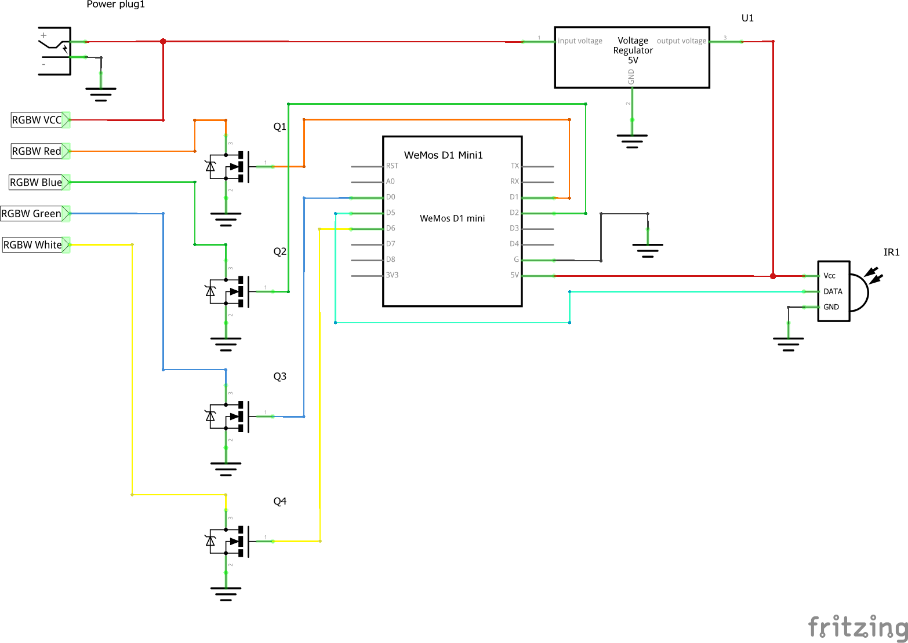

# LEDStripe

LEDStripe is a Arduino based Software to replace an LED-Controller with an ESP8266 on a Wemos D1 Mini board.

The project is managed by [platform.io](http://platformio.org/). platform.io is necessery for the library managment.

Because I only have a "dumb" LED-Strip where I can't control each LED on its own, my application only seperates the colors.

## My Hardware

+ Wemos D1 Mini (ESP8266 Board)
+ 12V Power supply
+ RGBWW (RGB + Wharm-White) LED-Strip with 5050 LEDs
+ IR-Receiver (shipped with LED-Strip + Controler)
+ LM7805 Linear 5V Voltage Regulator (It gets hot, I need to add a heat sink)
+ Mosfets from the original controler board

## Circuit diagram

